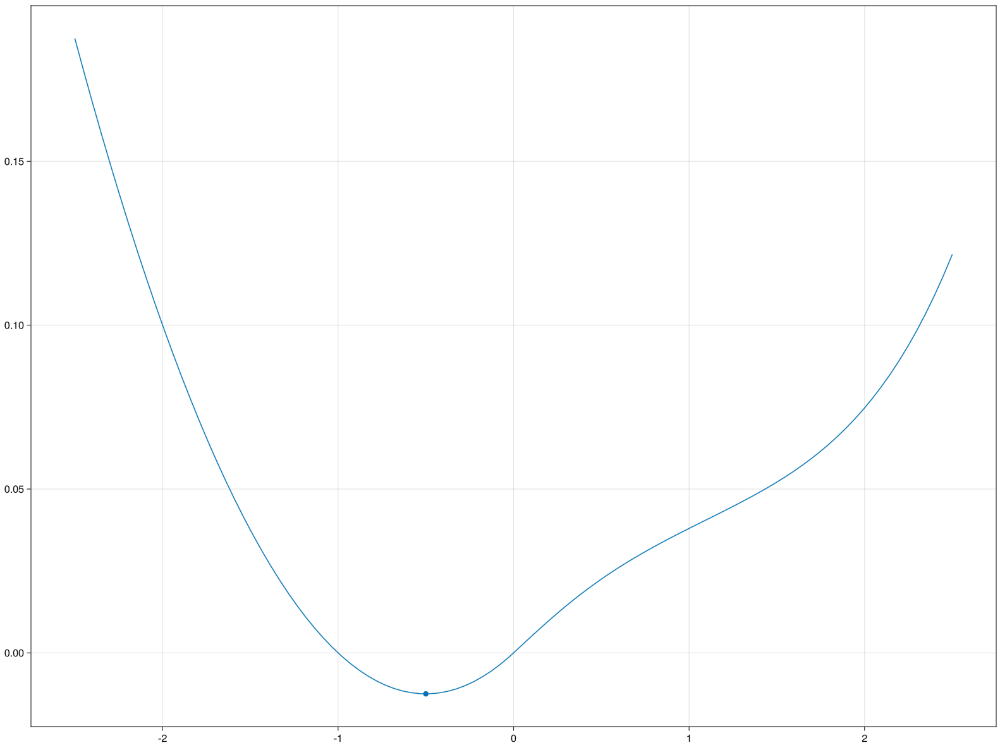

# [Example: Mountain Car Environment](@id lib-mountain-car)
On this page we will work out a more advanced example of an environment in `RxEnvironments`. The code on this page is the implementation of the Mountain Car environment in the core of the package. 

## Environment details
The mountain car environment is a classical environment that first appeared in [Andrew Moore's PhD thesis](https://www.cl.cam.ac.uk/techreports/UCAM-CL-TR-209.pdf), where a car is placed in the valley of a mountainous landscape. The car can apply accelerations to its position, and the goal is to get the car up the hills adjacent to the valley. However, the engine power of the car alone is not enough to get out of the valley, and thus the agents in the environment should figure out that it can use the additional speed gained from driving up and down the hill on the other side to get to the desired location. The agent therefore can conduct action $a \in [-1, 1]$ to change the direction and intensity of the engine force.

There are several forces that work on the car, namely:
- Gravitational force from the slope of the landscape.
- Friction force from movement.
- The power exerted by the engine of the car.

The gravitational force can be computed as follows, here $m$ is the mass of the car, $l(x)$ the landscape function as function of horizontal position $x$:
```math
F_g(x, m, l) = -9.81 \cdot m \cdot \left( \sin \arctan \frac{dl}{dx}(x)\right)
```

The friction force is linear in the velocity $v$ and the friction coefficient $c_f$ of the car:
```math
F_f(v, c_f) = - v \cdot c_f
```

The engine power is a direct effect of action $a$, and is scaled by constant engine power $c_e$:

```math
F_e(a, c_e) = a \cdot c_e
```

## RxEnvironments design pattern
The environment details explained above describe a set of differential equations governing the location and velocity of the car. In [classical implementations](https://mgoulao.github.io/gym-docs/environments/classic_control/mountain_car_continuous/) of the mountain car environment, the timestep is fixed and the differential equation is solved with the [Euler method](https://en.wikipedia.org/wiki/Euler_method). However, in `RxEnvironments` we have continuous time environments that are realized by varying the timestep between environment state updates. Therefore, using Euler's method to solve the system of differential equations accumulates errors in every timestep, and running the same environment twice might give us different realizations of the environment dynamics because of the way the errors are accumulated with varying timesteps between state updates. 

In order to still get consistent simulations, the following design pattern may be of use when building an environment in `RxEnvironments`, and we will also employ this design pattern when implementing the Mountain Car environment: We use the `DifferentialEquations.jl` package to determine the trajectory of a moving object over a longer period of time and save this in the state of the object. Then, whenever we have to do a state update, we first determine whether or not the trajectory is still valid (for example, there were no collisions or actions conducted that change the trajectory of the object). If the trajectory is still valid, we simply return the desired value from the precomputed trajectory. If the trajectory is not valid anymore, we recompute the trajectory with the updated state of the object and save the new trajectory in the state of the object. In this way, we obtain a consistent and accurate state update irrespective of the varying timestep size of the state updates.
## Implementing the environment
Now that we've specified the environment dynamics and the design pattern for getting accurate state updates, it is time to implement the environment in `RxEnvironments`.
### Setup
For this environment we have some specific requirements, please make sure these are installed. Furthermore, we define a generic landscape function to utilize, but the environment will also work with other (differentiable) landscape functions.
```@example mountaincar
import HypergeometricFunctions: _₂F₁
using Distributions
using ForwardDiff
using DifferentialEquations
using LinearAlgebra
using RxEnvironments

function landscape(x)
    if x < 0
        h = x^2 + x
    else
        h =
            x * _₂F₁(0.5, 0.5, 1.5, -5 * x^2) +
            x^3 * _₂F₁(1.5, 1.5, 2.5, -5 * x^2) / 3 +
            x^5 / 80
    end
    return 0.05 * h
end
```
### Defining environment structures
In order to implement the design pattern described above, we need to create a structure in which we are going to store the precomputed trajectory of the mountain car:
```@example mountaincar

mutable struct MountainCarTrajectory
    recompute::Bool
    time_left::Real
    trajectory::Any
    T::Real
end

# Convenient getters and setters
recompute(trajectory::MountainCarTrajectory) = trajectory.recompute
time_left(trajectory::MountainCarTrajectory) = trajectory.time_left
current_time(trajectory::MountainCarTrajectory) =
    total_time(trajectory) - time_left(trajectory)
total_time(trajectory::MountainCarTrajectory) = trajectory.T
Base.getindex(trajectory::MountainCarTrajectory, index) = trajectory.trajectory(index)


set_recompute!(trajectory::MountainCarTrajectory, recompute) =
    trajectory.recompute = recompute
set_time_left!(trajectory::MountainCarTrajectory, time_left) =
    trajectory.time_left = time_left
reduce_time_left!(trajectory::MountainCarTrajectory, elapsed_time) =
    set_time_left!(trajectory, time_left(trajectory) - elapsed_time)
```
Here, we also implement all helper functions that give us a convenient interface to work with this trajectory. This trajectory is wrapped in the state of a Mountain Car, which contains all variables of the mountain car that are subject to change, such as position and velocity.
```@example mountaincar

mutable struct MountainCarState
    position::Real
    velocity::Real
    throttle::Real
    trajectory::MountainCarTrajectory
end

# Convenient getters and setters
position(state::MountainCarState) = state.position
velocity(state::MountainCarState) = state.velocity
throttle(state::MountainCarState) = state.throttle
observable_state(state::MountainCarState) = [position(state), velocity(state)]

set_position!(state::MountainCarState, position::Real) = state.position = position
set_velocity!(state::MountainCarState, velocity::Real) = state.velocity = velocity
set_throttle!(state::MountainCarState, throttle::Real) = state.throttle = throttle
set_trajectory!(state::MountainCarState, trajectory) = state.trajectory = trajectory
trajectory(state::MountainCarState) = state.trajectory

# Convenient constructor that creates an empty trajectory that will immediately be replaced.
MountainCarState(position::Real, velocity::Real, throttle::Real) = MountainCarState(
    position,
    velocity,
    throttle,
    MountainCarTrajectory(true, 0.0, [], 0.0),
)
```

The actual Mountain Car struct will contain the state of the mountain car, as well as constants such as the engine power and friction coefficient:
```@example mountaincar


struct MountainCarAgent
    state::MountainCarState
    engine_power::Real
    friction_coefficient::Real
    mass::Real
    target::Real
end

MountainCarAgent(
    position::Real,
    engine_power::Real,
    friction_coefficient::Real,
    mass::Real,
    target::Real,
) = MountainCarAgent(
    MountainCarState(position, 0.0, 0.0),
    engine_power,
    friction_coefficient,
    mass,
    target,
)

# Convenient getters and setters
state(car::MountainCarAgent) = car.state
position(car::MountainCarAgent) = position(state(car))
velocity(car::MountainCarAgent) = velocity(state(car))
throttle(car::MountainCarAgent) = throttle(state(car))
mass(car::MountainCarAgent) = car.mass
observable_state(car::MountainCarAgent) = observable_state(state(car))

set_position!(car::MountainCarAgent, position::Real) = set_position!(state(car), position)
set_velocity!(car::MountainCarAgent, velocity::Real) = set_velocity!(state(car), velocity)
set_throttle!(car::MountainCarAgent, throttle::Real) = set_throttle!(state(car), throttle)
engine_power(car::MountainCarAgent) = car.engine_power
friction_coefficient(car::MountainCarAgent) = car.friction_coefficient
set_trajectory!(car::MountainCarAgent, trajectory) = set_trajectory!(state(car), trajectory)
trajectory(car::MountainCarAgent) = trajectory(state(car))
```

Now we are in a shape where we can define the actual environment, which will contain a landscape function and a collection of Mountain Cars:
```@example mountaincar
struct MountainCarEnvironment
    actors::Vector{MountainCarAgent}
    landscape::Any
end

MountainCarEnvironment(landscape) = MountainCarEnvironment([], landscape)
```

In order to encode the actions conducted by mountain car entities on the environment, we introduce a `Throttle` struct that clamps an input action between $-1$ and $1$:

```@example mountaincar
struct Throttle
    throttle::Real
    Throttle(throttle::Real) = new(clamp(throttle, -1, 1))
end
```
Our environment contains a field `actors`, however, we still have to tell `RxEnvironments` how to add entities to this field:
```@example mountaincar
function RxEnvironments.add_to_state!(environment::MountainCarEnvironment, agent::MountainCarAgent)
    push!(environment.actors, agent)
end
```
### Environment dynamics
When simulating the environment dynamics we need to be able to calculate all forces exerted on the car at any point in time:

```@example mountaincar
throttle(action::Throttle) = action.throttle
friction(car::MountainCarAgent, velocity) = velocity * -friction_coefficient(car)
gravitation(car::MountainCarAgent, position, landscape) =
    mass(car) * -9.81 * sin(atan(ForwardDiff.derivative(landscape, position)))
```

### Solving the differential equations
We have set up the infrastructure with which we can save a trajectory of a moving object in its state, and retrieve this trajectory during future state updates. For this, we use the [`DifferentialEquations.jl`](https://docs.sciml.ai/DiffEqDocs/stable/) package, and we refer to the documentation of the `DifferentialEquations.jl` package for a more comprehensive explanation of solving differential equations in Julia. This section merely shows an example of the desired design pattern in `RxEnvironments.jl`. We have to compute the dynamics of the mountain car and save this in the state of the mountain car:
```@example mountaincar
# DifferentialEquations.jl function describing the environment dynamics.
function __mountain_car_dynamics(du, u, s, t)
    agent, env = s
    position, momentum = u
    du[1] = momentum
    du[2] =
        throttle(agent) +
        friction(agent, momentum) +
        gravitation(agent, position, env.landscape)
end

# Function that computes a trajectory for a mountain car for 5 seconds ahead and saves this result in the state of the corresponding car.
function __compute_mountain_car_dynamics(
    agent::MountainCarAgent,
    environment::MountainCarEnvironment,
)
    T = 5.0
    initial_state = [position(agent), velocity(agent)]
    tspan = (0.0, T)
    prob = ODEProblem(__mountain_car_dynamics, initial_state, tspan, (agent, environment))
    sol = solve(prob, Tsit5())
    set_trajectory!(agent, MountainCarTrajectory(false, T, sol, T))
end
```

### Implementing `RxEnvironments` functions
All code we have written so far has served as setup for our environment, and we haven't written any core `RxEnvironments.jl` code yet. In this section we will write and elaborate on the necessary code to make our environment fully reactive. 

`RxEnvironments.jl` requires us to implement 3 functions specifically for our environment: `what_to_send`, `receive!` and `update!`:
`what_to_send(recipient, emitter)` determines the message `emitter` sends to `recipient`. In our example, this function describes how the environment presents an observation to the agent, as function of the environment state.
`receive!(recipient, emitter, observation)` determines how `observation` sent from `emitter` to `recipient` influences the internal state of `recipient`. In our example, this describes how a `Throttle` action from the agent changes the environment state.
`update!(entity, elapsed_time)` describes the state transition of `entity` for `elapsed_time` if there are no incoming observations. In our example, this is how the environment gravity and friction influence the position and velocity of the agent inbetween agent actions.
A notable detail is that, with our differential equations solution, we also have to check whenever we `update!` the environment if we have to recompute the trajectory for a mountain car, and whenever we `receive!` an action from an agent, that we should always recompute the trajectory.

```@example mountaincar 
# The agent observes a noisy estimate of its actual position and velocity
RxEnvironments.what_to_send(agent::MountainCarAgent, environment::MountainCarEnvironment) =
    return rand(MvNormal(observable_state(agent), I(2)))

function RxEnvironments.receive!(
    environment::MountainCarEnvironment,
    agent::MountainCarAgent,
    action::Throttle,
)
    # We always have to recompute the trajecory of an agent if this agent conducts an action
    set_recompute!(trajectory(agent), true)
    set_throttle!(agent, throttle(action) * engine_power(agent))
end

function update!(environment::MountainCarEnvironment, elapsed_time::Real)
    # Update all actors in the environment
    for agent in environment.actors
        # If we have conducted an action or the current trajecory is valid for less than `elapsed_time` seconds, recompute
        if recompute(trajectory(agent)) || time_left(trajectory(agent)) < elapsed_time
            __compute_mountain_car_dynamics(agent, environment)
        end
        # Bookkeeping for the trajecory, position and velocity
        reduce_time_left!(trajectory(agent), elapsed_time)
        new_state = trajectory(agent)[current_time(trajectory(agent))]
        set_position!(agent, new_state[1])
        set_velocity!(agent, new_state[2])
    end
end
```

With these funcitons we have specified the full environment behaviour, and the environment is now fully functional in `RxEnvironments.jl`. 
We can create the environment with the `RxEnvironment` factory method:
```@example mountaincar
car_engine_power = 0.6
car_friction_coefficient = 0.5
car_mass = 2
car_target = 1

env = RxEnvironment(MountainCarEnvironment(landscape))
agent = add!(
            env,
            MountainCarAgent(
                MountainCarState(-0.5, 0.0, 0.0),
                car_engine_power,
                car_friction_coefficient,
                car_mass,
                car_target,
            ),
        )
```

### Discrete-time Mountain Car
Classical control theory mainly deals with discrete-time environments, and it is actually very easy to convert the environment dynamics we have written in `RxEnvironments` to also define a discrete environment. In general, we can implement the `time_interval` function:
```julia
time_interval(env::YourEnvironment) = dt
```
for your choice of `dt`. For our mountain car environment, we can set the default timestep to $0.1$ as follows:
```julia
time_interval(env::MountainCarEnvironment) = 0.1
```
This will still utilize all environment dynamics we have written for the continuous case, but will create a discrete-time environment. In order to create a discrete-time environment, please make sure to include the `discrete=true` keyword argument for the `RxEnvironment` factory method:

```@example mountaincar
car_engine_power = 0.6
car_friction_coefficient = 0.5
car_mass = 2
car_target = 1

env = RxEnvironment(MountainCarEnvironment(landscape); is_discrete=true)
agent = add!(
            env,
            MountainCarAgent(
                MountainCarState(-0.5, 0.0, 0.0),
                car_engine_power,
                car_friction_coefficient,
                car_mass,
                car_target,
            ),
        )
```
### Animating the state of the environment
In order to animate the state of the environment, we have to install `GLMakie.jl` and implement the `plot_state` function for our environment.
```julia
using GLMakie

function RxEnvironments.plot_state(ax, environment::MountainCarEnvironment)
    x = range(-2.5, 2.5, 100)
    y = environment.landscape.(x)
    lines!(ax, x, y)
    for agent in environment.actors
        pos = position(agent)
        scatter!(ax, pos, environment.landscape(pos))
    end
end
```

Now we can call:
```julia
animate_state(env)
```
on an existing `RxEnvironment` wrapping the `MountainCarEnvironment` and obtain a similar visualization:
